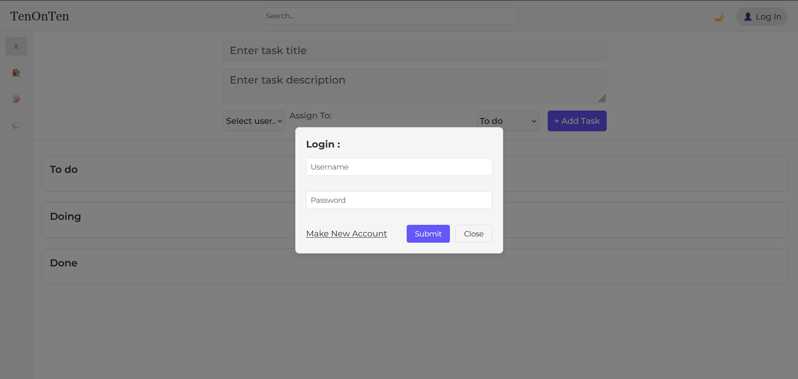
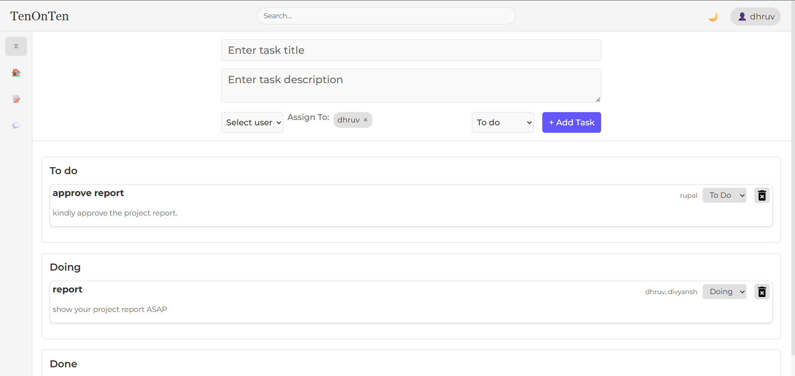
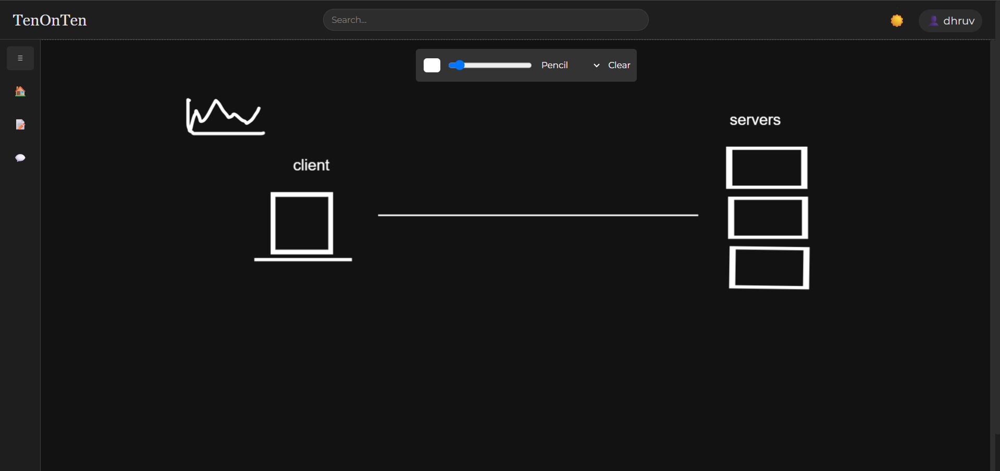
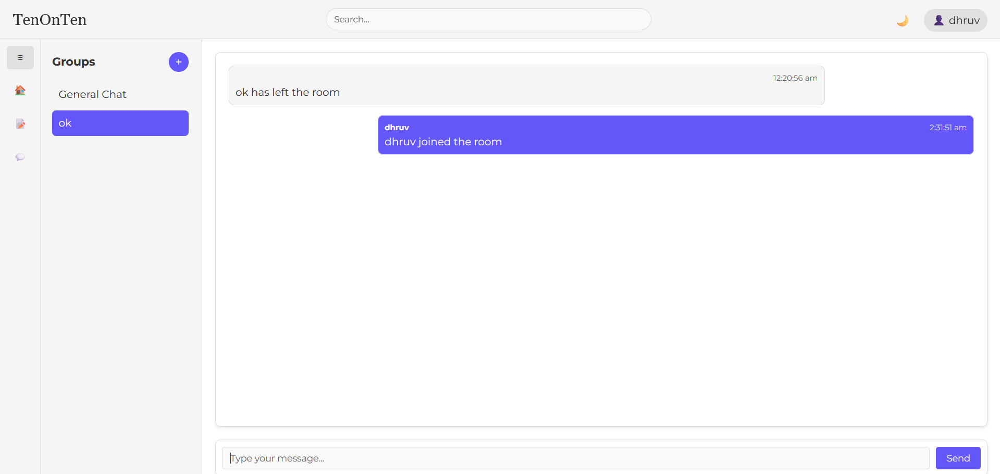
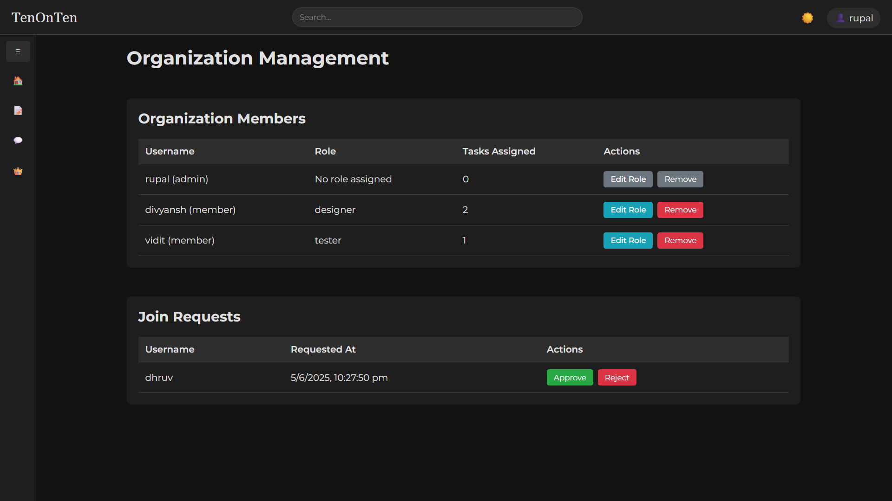

# TenOnTen
This is a project management web application.

## features:-
- users can communicate throught a witeboard.[a draw app like excalidraw]
- assign tasks to each other.[like a todo list that everyone can see and assign to a perticular person]
- chat within a group or personally.

## Reference Images






## Technologies Used

- React
- React-Router-Dom
- Express
- Fiber Library
- WebSockets - `ws` Library
- MongoDB - Mongoose
- JsonWebToken
- Dotenv

## Getting Started

Follow these instructions to get a copy of the project up and running on your local machine for development and testing purposes.

### Prerequisites

Make sure you have the following installed:

- [Node.js](https://nodejs.org/)
- [npm](https://www.npmjs.com/) (comes with Node.js) or [yarn](https://yarnpkg.com/) (if you prefer)

### Installation

1. Clone the repository:
   ```bash
   git clone https://github.com/DhruvFromEarth/TenOnTen.git
   ```

2. Navigate to the project directory:
   ```bash
   cd TenOnTen
   ```

3. Install the dependencies:
   ```bash
   npm install
   ```
   or if you are using yarn:
   ```bash
   yarn install
   ```

### Usage

To start the development server, run:
```bash
npm run dev
```
or if you are using yarn:
```bash
yarn run dev
```